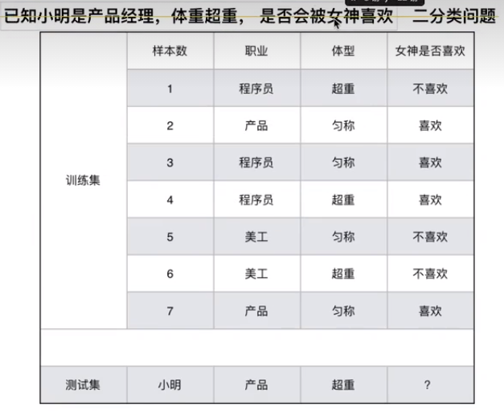
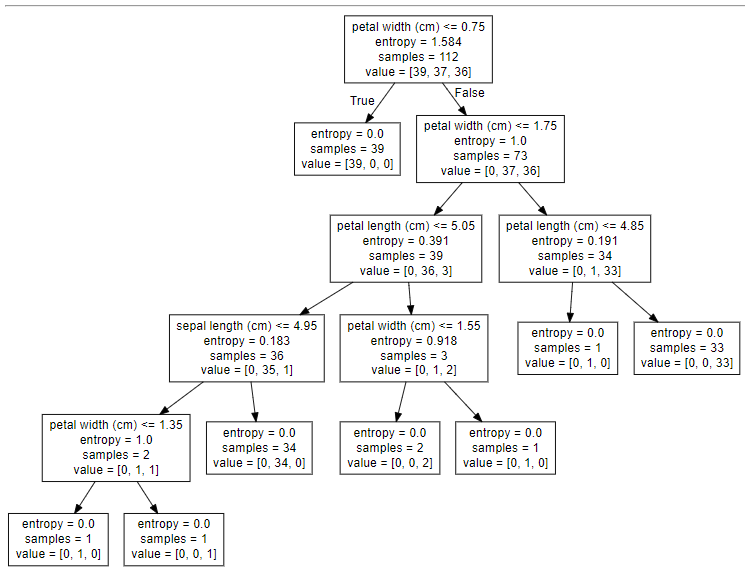
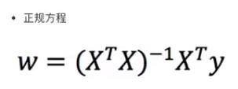
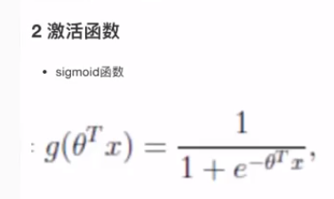
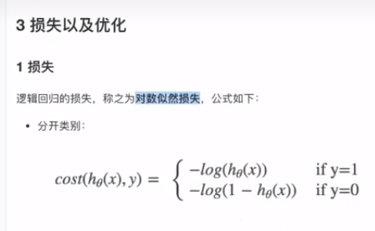
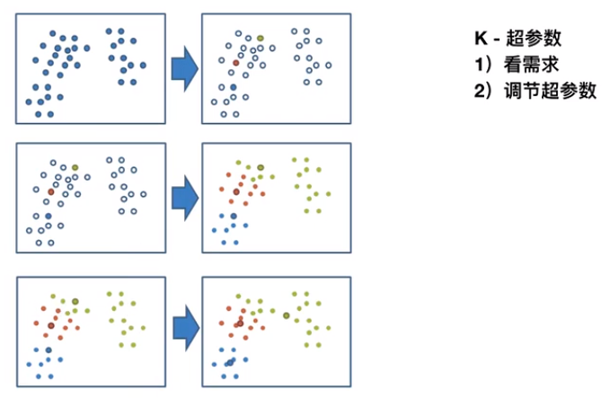
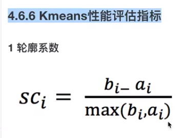

# 一、机器学习概述

##  1.1人工智能概述

### 1.人工智能起源

图灵测试

达特茅斯会议

### 2.人工智能三个阶段

1980年代是正式成形期

1990-2010年代是蓬勃发展期

**2012**年之后是深度学习期

## 3.人工智能、机器学习和深度学习

机器学习是人工智能的一个实现途径

深度学习是机器学习的一个方法发展而来

## 4.主要分支介绍 

1.计算机视觉 

2.自然语言处理 eg:人脸识别 语音识别 语义识别
3.机器人

## 5.人工智能必备三要素

数据  算法  计算力

## 6. gpu,cpu

gpu --计算密集型

cpu--IO密集型

# 二、机器学习工作流程

## 1.定义

### 数据

自动分析获得模型

### 预测

从数据中自动分析获得模型，并利用模型对未知数据进行预测

## 2.算法分类

### 监督学习

- 目标值:类别-分类问题

- 目标值:连续型的数据 - 回归问题

### 无监督学习

目标值:无

### 示例

- 预测明天的气温是多少度? 回归
- 预测明天是阴、晴还是雨? 分类
- 人脸年龄预测? 回归/分类
- 人脸识别? 分类

## 3.机器学习开发流程

- 流程
  - 1）获取数据
  - 2）数据处理
  - 3）特征工程
  - 4）机器学习算法训练－模型
  - 5）模型评估
  - 6）应用

- 需明确几点问题

  - (1)算法是核心，数据与计算是基础

  - (2)找准定位

- 大部分复杂模型的算法设计都是算法工程师在做，而我们

  - 分析很多的数据

  - 分析具体的业务

  - 应用常见的算法

  - 特征工程、调参数、优化

- 库和框架


- 数据集
  - Kaggle网址：https://www.kaggle.com/datasets
  - UCi数据集网址：http://archive.ics.uci.edu/ml/
  - scikit-learn网址：http://scikit-learn.org/stable/datasets/index.html#datasets


#  三、Scikit-learn工具介绍

## 1、特点

- Python语言的机器学习工具
- Scikit-learn包括许多知名的机器学习算法的实现
- Scikit-learn文档完善，容易上手，非富的API
- 目前稳定版本0.19.1

## 2、数据集

- 小数据集
- 大数据集

#### ①sklearn.datasets

load_* 获取小规模数据集

fetch_* 获取大规模数据集

#### ②数据集的划分

##### 机器学习一般的数据集会划分为两个部分：

- 训练数据：用于训练，构建模型
- 测试数据：在模型检验时使用，用于评估模型是否有效
- 划分比例：
  - 训练集：70%80%75%
  - 测试集：30%20%30%
- 数据集划分api
- `sklearn.model_selection.train_test_split(arrays, *options)`
  - `x`数据集的特征值
  - `y`数据集的标签值
  - `test_size`测试集的大小，一般为float
  - `random_state`随机数种子，不同的种子会造成不同的随机采样结果。相同
    的种子采样结果相同。
  - `return`训练集特征值，测试集特征值，训练集目标值，测试集目标值
- 数据集的返回值
  - datasets.base.Bunch (继承自字典)
  - dict["key"] = values
  - bunch. key = values

```python
#load_? 获取小规模数据集 fetch_? 获取大规模数据集,这里是小数据集
from sklearn.datasets import load_iris
from sklearn.model_selection import train_test_split

def datasets_demo():
    iris = load_iris()
    print('鸢尾花数据集:\n', iris)
    print('查看数据集描述:\n', iris["DESCR"])
    print('查看特征值的名字:\n', iris.feature_names)
    # 总共150
    print('查看特征值:\n', iris.data, iris.data.shape)
    # test_size:训练集和测试集的划分分比例
    # random_state：随机数种子
    x_train, x_test, y_train, y_test = train_test_split(iris.data, iris.target, test_size=0.2, random_state=22)
    # 120,---显然占总数据集的0.2
    print('训练集的特征值:\n', x_train, x_train.shape)
    
if __name__ == '__main__':
    datasets_demo()
```

# 四、特征工程

- 包含内容

  - 特征抽取

  - 特征预处理

  - 特征降维

## 特征提取

1将任意数据（如文本或图像）转换为可用于机器学习的数字特征

注：特征值化是为了计算机更好的去理解数据

字典特征提取（特征离散化）

文本特征提取

图像特征提取（深度学习将介绍）

2特征提取API

sklearn.feature_extraction


### 2.3.2字典特征提取

作用：对字典数据进行特征值化

转成one-hot编码(更为公平)

`sklearn.feature_extraction.DictVectorizer(sparse=True,...)`
`DictVectorizer.fit_transform()` X:字典或者包含字典的选代器返回值：返回sparse矩阵

`DictVectorizer.inverse_transform(X)`X:array数组或者sparse矩阵返回值：转换之前数据格式

`DictVectorizer.get_feature_names()`返回类别名称

vector 数学:向量  物理:矢量矩阵

matrix二维数组向量

vector 一维数组

```python
def dict_transfer_demo():
    from sklearn.feature_extraction import DictVectorizer
    data = [
        {'city': '北京', 'temperature': 60},
        {'city': '上海', 'temperature': 30},
        {'city': '深圳', 'temperature': 20}
    ]
    # 1实例化一个转换器
    # 返回的是sparse（稀疏：只把不是0的值的位置表示出来）矩阵,需要设置sparse=False
    transfer = DictVectorizer(sparse=False)
    # 2调用transform
    data_transformed = transfer.fit_transform(data)
    print(data_transformed)
    print('特征的名称：',transfer.feature_names_)
```


### 2.3.3文本特征提取

作用：对文本数据进行特征值化
`sklearn.feature_extraction.text.CountVectorizer(stop_words=[])`
返回词频矩阵
`CountVectorizer.fit_transform(X)`X:文本或者包含文本字符串的可选代对象返
回值：返回sparse矩阵
`CountVectorizerinverse_transform(X)`X:array数组或者sparse矩阵返回值：转
换之前数据格
`CountVectorizer.get_feature_names()`返回慎：单词列表
sklearn.feature_extraction.text.TfidfVectorizer

```python
def CountVectorizer_transfer_demo():
    from sklearn.feature_extraction import DictVectorizer
    # 把短的单词过滤掉了。CountVectorizer(stop_words=[])stop_words是停用词，把不要的词过滤掉
    # 英文：
    data_en = ["life is short,i like like python", "ife is too long,i dislike python"]
    # 中文需要分割
    data_ch = ["我 爱 北京 天安门", "天安门 爱 国旗 飘"]
    data = data_ch
    # 实例化一个转换器
    transfer = CountVectorizer()
    # CountVectorizer有个toarray()方法把文本特征抽取成二维数组
    data_transformed = transfer.fit_transform(data).toarray()
    print(data_transformed)
    print(transfer.get_feature_names_out())
```

中文进行分词：需要jieba库：`pip install jieba`

```python
import jieba
text = '我爱北京天安门，添饭有我你是谁，是人是鬼看不起''
cuted_str = ' '.join(list(jieba.cut(text)))
# 输出字符串：我 爱 北京 天安门
```

关键词：出现次数多的

### 5 Tf-idf文本特征提取

- TF-IDF的主要思想是：如果某个词或短语在一篇文章中出现的概率高，并且在其他
  文章中很少出现，则认为此词或者短语具有很好的类别区分能力，适合用来分类。

- TF-IDF作用：用以评估一字词对于一个文件集或一个语料库中的其中一份文件的
  重要程度。
- 5.1公式
- 词频(term frequency,tf)指的是某一个给定的词语在该文件中出现的频率
- 逆向文档频率(inversedocument frequency,idf)是一个词语普遍重要性的度量。某一特定词语的idf，可以由总文件数目除以包含该词语之文件的数目，再将得到的商取以10为底的对数得到

#### 5.2 API

- `sklearn.feature_extraction.text.TfidfVectorizer(stop_words=None,...)`
- 返回词的权重矩阵
- `TfidfVectorizer.fit_transform()` X:文本或者包含文本字符串的可迭代对象，返回值：返回sparse矩阵
  `TfidfVectorizer.inverse_transform(X)`X:array数组或者sparse矩阵，返回值：转换之前数据格式
- `TfidfVectorizer.get_feature_names()`返回值：单词列表

## 特征预处理

将数据处理成0-1内

### 1、归一化

通过对原始数据进行变换把数据映射到(默认为[0,1])之间

公式：`x' = （x-min）/（max-min）`

`x" = x'  *（mx-mi）+mi`

`sklearn.preprocessing.MinMaxScaler (feature_range=(0,1)... )`

`MinMaxScalar.fit_transform(X)`

`X:numpy array格式的数据[n_samples,n_features]`。返回值: 转换后的形状相同的array

```python
import pandas as pd
from sklearn.preprocessing import MinMaxScaler,StandardScaler
data={
    'milage':    [40920   ,14488   ,26052   ,75136    ,48111   ,43757    ],
    'Liters':    [8.326976,7.153469,1.441871,13.147394,9.134528,7.882601 ],
    'Consumtime':[0.953952,1.673904,0.895124,0.428954 ,0.728045 ,1.332446],
    'target':    [3       ,2       ,       1,        1,        3,       3]
}
data = pd.DataFrame(data)
```

```python
def minmax_demo():
    '''
    归一化演示
    '''
    # 实例化
    '''
    创建了一个名为transformer的MinMaxScaler对象
    feature_range=(3,5)表示将特征缩放到3到5的范围内。
    '''
    transformer = MinMaxScaler(feature_range=(3,5))
    # 进行转换
    ret_data = transformer.fit_transform(data[['milage','Liters','Consumtime']])
    print(ret_data)
```

### 2、标准化

`x' = (x-mean)/σ`    σ：标准差

- 对于归一化来说: 如果出现异常点，影响了最大值和最小值，那么结果显然会发生改变
- 对于标准化来说: 如果出现异常点，由于具有一定数据量，少量的异常点对于平均值的影响并不大，从.而方差改变较小。

```python
# from sklearn.preprocessing import MinMaxScaler,StandardScaler
def stand_demo():
    '''
    标准化演示
    '''
    # 实例化
    transformer = StandardScaler()
    # 进行转换
    ret_data = transformer.fit_transform(data[['milage','Liters','Consumtime']])
    print(ret_data)
    # 每列方差：
    print('每列方差:',transformer.var_)
    # 每列平均值：
    print('每列平均值:',transformer.mean_)
```

## 特征降纬

ndarray
维数: 套的层数

|0维|量|
| :--: | :--: |
| 1维  |向量|
| 2维  |矩阵|
| 3维  |，，|

- 此处的降维:降低特征的个数效果:特征与特征之间不相关

- 降维的两种方式
  - 特征选择
  - 主成分分析 (可以理解一种特征提取的方式)

- Filter（过滤式）：主要探究特征本身特点、特征与特征和目标值之间关联
  - 方差选择法：低方差特征过滤
  - 相关系数:特征与特征之间的相关程度
- Embedded（嵌入式）：算法自动选择特征（特征与目标值之间的关联）
  - 决策树：信息、信息增益
  - 正则化：L1、L2
  - 深度学习：卷积等
- 对于Embedded方式，只能在讲解算法的时候在进行介绍，更好的去理解

- API：`sklearn.feature_selection`

### 过滤式

#### 4.1低方差特征过滤

- 删除低方差的一些特征，前面讲过方差的意义。再结合方差的大小来考虑这个
  方式的角度。
- 特征方差小：某个特征大多样本的值比较相近
- 特征方差大：某个特征很多样本的值都有差别
- API：
- `sklearn.feature_selection.VarianceThreshold(threshold = 0.0)`
  - 删除所有低方差特征
  - `Variance.fit_transform(X)`
    - X:numpyarray格式的数据[n_samples,n_features]
    - 返回值：训练集差异低于threshold的特征将被删除。默认值是保
      留所有非零方差特征，即删除所有样本中具有相同值的特征。

```python
def variance_demo(data):
    from sklearn.feature_selection import VarianceThreshold
    # 实例化
    # threshold = 3 阈值设置，过滤掉低的方差
    transfer = VarianceThreshold(threshold=3)
    data_transformed = transfer.fit(data)
    print(data_transformed)
```

#### 4.2相关系数

- 皮尔逊相关系数(Pearson Correlation Coefficient)。 反映变量之间相关关系密切程度的统计指标
  4.2.2 公式计算案例(了解，不用记忆)

- 特点
- 相关系数的值介于-1与+1之间，即-1≤r≤+1。其性质如下：
- 当r>0时，表示两变量正相关，r<0时，两变量为负相关
- 当r=1时，表示两变量为完全相关，当r=0时，表示两变量间无相关关系
- 当0<|r<1时，表示两变量存在一定程度的相关。且|r|越接近1，两变量间线性关系越密切；Ir越接近于0，表示两变量的线性相关越弱
- 一般可按三级划分：r<0.4为低度相关；0.4≤|rk<0.7为显著性相关；0.7≤rl<1为高度线性相关 这个符号：Ir为r的绝对值，1-5]=5

```python
def scipy_demo(x_data,y_data):
    from scipy.stats import pearsonr
    pr = pearsonr(x_data,y_data)
    #看这两个的相关性，pandas中有类似的方法
    print(pr)
```

- 特征与特征之间相关性很高
  - 1)取其中一个
  - 2)加权求和
  - 3)主成分分析

- 主成分分析
  - 2 API
  - `sklearn.decomposition.PCA(n_components=None)`将数据分解为较低维数空间
    - n_components:    1-小数:表示保留百分之多少的信息。2-整数: 减少到多少个特征。
  - `PCAfit_transform(X)`
    - X:numpy array格式的数据(n_samples,n_features)返回值: 转换后指定维度的array

```python
from sklearn.decomposition import PCA
def pca_demo():
    # 四个特征值
    data = [[2, 8, 4, 5], [6, 3, 8, 8], [5, 4, 9, 11]]
    # 实例化
    transfer = PCA(n_components=0.2)
    data_transformed = transfer.fit_transform(data)
    print(data_transformed)
    """
    n_components=2转变后是2个特征值：
        [[ 5.69068343 -0.24610268]
        [-2.19024793  1.72643904]
        [-3.5004355  -1.48033637]]
    n_components=0,2转变后是20%：1个的特征值：
        [[ 5.69068343]
         [-2.19024793]
         [-3.5004355 ]]
     """
```

# 五、sklearn的转换器和估计器

## 1、转换器

- `fit_transform()`
  - `fit()`:计算每列的平均值、标准差
  - `transform()`：（x-mean）/std进行最终转换

## 2、估计器

- estimater


# 六、KNN-k近邻算法

## 1. K-近邻算法(KNN)概念

KNearestNeighbor算法又叫KNN算法，这个算法是机器学习里面一个比较经典的算法，总体来说KNN算法是相对比较容易理解的算法

- 定义
  如果一个样本在特征空间中的k个最相似（即特征空间中最邻近）的样本中的大多数属于某一个类别，则该样本也属于这个类别。
- 来源：KNN算法最早是由Cover和Hart提出的一种分类算法
- 距离公式
  两个样本的距离可以通过如下公式计算，又叫欧式距离，关于距离公式会在后面进行讨论


## 2. API和过程

- sklearn.neighbors.KNeighborsClassifier(n_neighbors=5,algorithm='auto')。
  - n_neighbors:int,可选 (默认= 5)，k_neighbors查询默认使用的邻居数。
  - algorithm:{auto，"ball_tree，“kd_tree’，“brute}，可选用于计算最近邻居的算法:
    - “ball_tree将会使用 BallTree,
    - "kd_tree将使用 KDTree。
    - “auto“将尝试根据传递给fit方法的值来决定最合适的算法。(不同实现方式影响效率)

```python
from sklearn.datasets import load_iris
from sklearn.model_selection import train_test_split
from sklearn.preprocessing import StandardScaler
from sklearn.neighbors import KNeighborsClassifier
def knn_iris():
    # 1 获取数据
    iris = load_iris()
    # 2 划分数据集(顺序不动)
    x_train, x_test, y_train, y_test = train_test_split(iris.data, iris.target, random_state=6)
    # 3 特征工程：采用标准化
    transfer = StandardScaler()
    x_train = transfer.fit_transform(x_train)
    x_test = transfer.transform(x_test)
    # 4 KNN算法
    estimator = KNeighborsClassifier(n_neighbors=3)
    estimator.fit(x_train, y_train)
    # 5 模型评估
    # 方法1：直接比对真实值和预测值
    y_pred = estimator.predict(x_test)
    print('方法1：直接比对真实值和预测值\n', y_pred == y_test)
    # 方法2：计算准确率
    score = estimator.score(x_test, y_test)
    print('准确率\n', score)
"""
方法1：直接比对真实值和预测值
 [ True  True  True  True  True  True False  True  True  True  True  True
  True  True  True False  True  True  True  True  True  True  True  True
  True  True  True  True  True  True  True  True  True  True False  True
  True  True]
准确率
 0.9210526315789473
 """
```

## 3. 结果分析

- 1 k值取多大?有什么影响?k值取很小:容易受到异常点的影响k值取很大:受到样本均衡的问题
- 2 性能问题?
  - 距离计算上面，时间复杂度高

- K-近邻总结

  - 优点：
    - 简单，易于理解，易于实现，无需训练。
    
    - 缺点:
      - 懒惰算法，对测试样本分类时的计算量大，内存开销大9必须指定K值，K值选择不当则分类精度不能保证
    
  - 使用场景
    - 小数据场景，几千~几万样本，具体场景具体业务去测试


## 3. 模型选择与调优

- 鸢尾花数据集预测
  -  Facebook签到位置预测调优。内容预览
  - 什么是交叉验证(cross validation)
  - 超参数搜索-网格搜索(Grid Search)
  - 尾花案例增加K值调优
  - 案例:预测acebook签到位置

- 模型选择与调优API
  - 网格搜索`sklearn.model_selection.GridSearchCV(estimator, param_grid=None,cv=None)`

- 对估计器的指定参数值进行详尽搜索、
  - `estimator`:估计器对象
  - `param_grid`:估计器参数(dict)[“n_neighbors”:[1,3,5]
  -  `cv`: 指定几折交叉验证（百分之几变成小数）
  -  `fit()`:输入训练数据
  -  `score()`:准确率
- 结果分析:
  - 最佳参数:best_params_
  - 最佳结果:best_score_
  - 最佳估计器: best_estimator_
  - 交叉验证结果: cv_results_

```python
from sklearn.datasets import load_iris
from sklearn.model_selection import train_test_split, GridSearchCV
from sklearn.preprocessing import StandardScaler
from sklearn.neighbors import KNeighborsClassifier

def knn_iris():
    # 1 获取数据
    iris = load_iris()
    # 2 划分数据集(顺序不动)
    x_train, x_test, y_train, y_test = train_test_split(iris.data, iris.target, random_state=22)
    # 3 特征工程：采用标准化
    transfer = StandardScaler()
    x_train = transfer.fit_transform(x_train)
    x_test = transfer.transform(x_test)
    # 4 KNN算法
    estimator = KNeighborsClassifier()
    # 5 数据准备
    param_grid = {'n_neighbors': [1, 3, 5, 7, 9, 11]}
    # 6 加入网格搜索与交叉验证
    estimator = GridSearchCV(estimator,param_grid=param_grid, cv=10)
    estimator.fit(x_train, y_train)
    # 6 模型评估
    # - 最佳参数: best_params_
    print('最佳参数: best_params_\n', estimator.best_params_)
    # - 最佳结果: best_score_
    print('最佳结果: best_score_\n', estimator.best_score_)
    # - 最佳估计器: best_estimator_
    print('最佳估计器: best_estimator_\n', estimator.best_estimator_)
    # - 交叉验证结果: cv_results_
    print('交叉验证结果: cv_results_\n', estimator.cv_results_)

if __name__ == '__main__':
    knn_iris()
```

- 输出结果：

  - 最佳参数: best_params_
     {'n_neighbors': 3}

  - 最佳结果: best_score_
     0.9553030303030303

  - 最佳估计器: best_estimator_
     KNeighborsClassifier(n_neighbors=3)

  - 交叉验证结果: cv_results_

```json
 {
	'mean_fit_time': array([0.00109901, 0.00279815, 0.00219915, 0.00119867, 0.0013998 ,0.00150082]), 
	'std_fit_time': array([0.0006996 , 0.00235685, 0.00203957, 0.00059855, 0.00049043,0.00102396]), 
	'mean_score_time': array([0.00869505, 0.01189315, 0.00399759, 0.0044965 , 0.00469642,0.00439522]), 
     'std_score_time': array([0.0121425 , 0.01142533, 0.00099983, 0.0020604 , 0.00209828,0.00101912]), 
     'param_n_neighbors': masked_array(data=[1, 3, 5, 7, 9, 11],mask=[False, False, False, False, False, False],fill_value='?',dtype=object), 
     'params': [{'n_neighbors': 1}, {'n_neighbors': 3}, {'n_neighbors': 5}, {'n_neighbors': 7}, {'n_neighbors': 9}, {'n_neighbors': 11}], 
     'split0_test_score': array([0.91666667, 0.91666667, 1.        , 1.        , 0.91666667, 0.91666667]), 
     'split1_test_score': array([1., 1., 1., 1., 1., 1.]),
     'split2_test_score': array([0.90909091, 0.90909091, 0.90909091, 0.90909091, 0.90909091,0.90909091]), 
     'split3_test_score':array([0.90909091, 1.        , 0.90909091, 0.90909091, 0.90909091,1.        ]), 
     'split4_test_score': array([1., 1., 1., 1., 1., 1.]), 
     'split5_test_score': array([0.90909091, 0.90909091, 0.90909091, 0.90909091, 0.90909091, 0.90909091]), 
     'split6_test_score': array([0.90909091, 0.90909091, 0.90909091, 1.        , 1.        ,1.        ]), 
     'split7_test_score': array([0.90909091, 0.90909091, 0.81818182, 0.81818182, 0.81818182,0.81818182]), 
     'split8_test_score': array([1., 1., 1., 1., 1., 1.]),
     'split9_test_score': array([1., 1., 1., 1., 1., 1.]),
     'mean_test_score': array([0.94621212, 0.95530303, 0.94545455, 0.95454545, 0.94621212, 0.95530303]), 
     'std_test_score': array([0.04397204, 0.0447483 , 0.06030227, 0.06098367, 0.05988683, 0.0604591 ]), 
     'rank_test_score': array([4, 1, 6, 3, 4, 1])}
```

# 七、案例：Facebook签到


# 八、朴素贝叶斯算法

## 1、概率与应用场景

- 朴素贝叶斯一般用于文本分类

- 拉普拉斯平滑系数



- api:
  - `sklearn.naive_bayes.MultinomialNB(alpha = 1.0)`
    朴素贝叶斯分类
    alpha:拉普拉斯平滑系数

- 案例:20大新闻进行分类

```python
def nb_news():
    # 20大新闻数据进行分类。
    # 获取数据
    from sklearn.datasets import fetch_20newsgroups
    news = fetch_20newsgroups(subset='all')
    # 数据划分
    from sklearn.model_selection import train_test_split
    x_train, x_test, y_train, y_test = train_test_split(news.data, news.target)
    # 特征工程--采用文本提取
    from sklearn.feature_extraction.text import TfidfVectorizer
    transformer = TfidfVectorizer()
    x_train = transformer.fit_transform(x_train)
    x_test = transformer.transform(x_test)
    # 算法训练
    from sklearn.naive_bayes import MultinomialNB
    estimator = MultinomialNB()
    estimator.fit(x_train, y_train)
    # 模型评估
    y_pred = estimator.predict(x_test)
    print('预测值与测试值进行比对\n',y_pred == y_test)
    # 准确率：
    score = estimator.score(x_test, y_test)
    print('准确率：\n',score)
```

- 输出结果

  - 预测值与测试值进行比对
     [ True  True  True ...  True  True  True]

  - 准确率：
     0.8461375212224108

- 模型调优
  - 如果需要对模型进行调优，则对`sklearn.naive_bayes.MultinomialNB(alpha = 1.0)`中的***alpha***值进行调优
- 朴素贝叶斯算法总结
  - 优点:
    - 朴素贝叶斯模型发源于古典数学理论，有稳定的分类效率。对缺失数据不太敏感，算法也比较简单，常用于文本分类
    - 分类准确度高，速度快
  - 缺点:
    - 由于使用了样本属性独立性的假设，所以如果特征属性有关联时其效果不好
  - 总结
    - 条件概率、联合概率计算方式与特征独立的关系
    - 贝叶斯公式的计算


# 九、决策树

决策树的划分依据之一------信息增益

3.53决策树API

- class sklearn.tree.DecisionTreeClassifier(criterion='gini",max_depth=None,random_state=None)
  决策树分类器
- criterion:默认是"gini"系数，也可以选择信息增益的熵"entropy"
- max_depth:树的深度大小
-  random_state:随机数种子


```python
def des_tree_iris():
    # 获取数据
    from sklearn.datasets import load_iris
    data = load_iris()
    # 数据划分
    from sklearn.model_selection import train_test_split
    x_train, x_test, y_train, y_test = train_test_split(data.data,data.target,random_state=22)
    # 决策树不需要特征工程
    # 选择模型决策树
    from sklearn.tree import DecisionTreeClassifier
    estimator = DecisionTreeClassifier(criterion='entropy')
    estimator.fit(x_train,y_train)
    # 模型评估
    y_pred = estimator.predict(x_test)
    print('直接对比预测值和测试值\n',y_pred == y_test)
    score = estimator.score(x_test,y_test)
    print('准确率\n',score)
    # 可视化决策树
    from sklearn.tree import export_graphviz
    export_graphviz(estimator,out_file='iris_tree.dot',feature_names=data.feature_names)

```

- 输出结果

  - 直接对比预测值和测试值
     [ True  True  True  True  True  True  True False  True  True  True  True
      True  True  True  True  True  True False  True  True  True  True  True
      True  True  True  True  True False  True  True  True  True  True  True
      True  True]

  - 准确率
     0.9210526315789473

决策树可视化

- `sklearn.tree.export_graphviz()` 该函数能够导出DOT格式
- `tree.export_graphviz(estimator,out_file='tree.dot,feature_names=[","])`
  `export_graphviz(dc, out_file="./tree.dot"， feature_names='')`

- 将生成的dot文件放在[Webgraphviz](http://webgraphviz.com/)网站中即可看到树



## 决策树总结

- 优点:
  - 简单的理解和解释，树木可视化
- 缺点:
  - 决策树学习者可以创建不能很好地推广数据的过于复杂的树，这被称为过拟合。改进:
    减枝cart算法(决策树API当中已经实现，随机森林参数调优有相关介绍)
  - 随机森林
    注:企业重要决策，由于决策树很好的分析能力，在决策过程应用较多，可以选择特征
- 总结
  - 信息熵、信息增益的计算
  - DecisionTreeClassifier进行决策树的划分
  - export_graphviz导出到dot文件


# 十、案例：泰坦尼克号

## 流程

1. 获取数据
2. 数据处理
   - 缺失值处理
   - 特征值 ->字典类型
3. 准备好特征值 目标值
4. 划分数据集
5. 特征工程:字典特征抽取
6. 决策树预估器流程
7. 模型评估

# 十一、集成学习方法之随机森林

## 概念

- 什么是集成学习方法
  - 集成学习通过建立几个模型组合的来解决单一预测问题。它的工作原理是生成多个分类器/模型，各自独立地学习和作出预测。这些预测最后结合成组合预测，因此优于任何一个单分类的做出预测。
- 什么是随机森林
  - 在机器学习中，随机森林是一个包含多个决策树的分类器，并且其输出的类别是由个别树输出的类别的众数而定。

- 随机森林原理过程

  - 学习算法根据下列算法而建造每棵树:用N来表示训练用例 (样本)的个数，M表示特征数目。。1一次随机选出一个样本，重复N次， (有可能出现重复的样本)。2随机去选出m个特征,m <<M，建立决策树
  - 采取bootstrap抽样

- 为什么采用BootStrap抽样

  - 为什么要随机抽样训练集?
  - 如果不进行随机抽样，每棵树的训练集都一样，那么最终训练出的树分类结果也是完全一样的
  - 为什么要有放回地抽样?
  - 如果不是有放回的抽样，那么每棵树的训练样本都是不同的，都是没有交集的这样每棵树都是“有偏的”，都是绝对“片面的”(当然这样说可能不对)，也就是说每棵树训练出来都是有很大的差异的;而随机森林最后分类取决于多棵树(弱分类器)的投票表决。

  ## API

`class sklearnensemble.RandomForestClassifier(n_estimators=10, criterion='ginimax_depth=None, bootstrap=True, random_state=None, min_samples split=2)`

- 随机森林分类器
- n_estimators: integer，optional (default = 10)
  - 森林里的树木数量120,200,300,500,800,1200
-  criteria: string，可选 (default =“gini”) 分割特征的测量方法
- max_depth: integer或None，可选 (默认=无)
  - 树的最大深度5,8,15,25,30
- max_features="auto”,每个决策树的最大特征数量
  - If "auto", then max_features=sqrt(n_features)
  - If "sqrt", then max_features=sqrt(n_features) (same as “auto").
  - If"log2",then max_features=log2(n_features) 
  - If None, then max_features=n_features
-  bootstrap: boolean，optional (default = True)是否在构建树时使用放回抽样。
- min_samples_split:节点划分最少样本数。
-  min_samples_leaf:叶子节点的最小样本数超参数
- n_estimator, max_depth, min_samples_split,min_samples_leaf

```python
#省略前面的步骤
#网格搜索进行模型调优
from sklearn.ensemble import RandomForestClassifier
estimator = RandomForestClassifier()
param_dict = {'n_estimators': [120,200,300,500,800,1200],
              'max_depth': [5,8,15,25,30],
              }
from sklearn.model_selection import GridSearchCV
estimator = GridSearchCV(estimator, param_grid=param_dict,cv=3)
estimator.fit(x_train,y_train)
#省略后面的步骤
```

## 总结

- 在当前所有算法中，具有极好的准确率
- 能够有效地运行在大数据集上，处理具有高维特征的输入样本，而且不需要降维能够评估各个特征在分类问题上的重要性


# 十二、线性回归

## 误差与损失函数


乘法不好算，所以取对数把乘法问题变成加法问题


学习过程


负号指的是梯度的反方向。小批量梯度下降更实用点。


损失函数：最小二乘法

优化方法：正规方程、梯度下降



## API

- `sklearn.linear_model.LinearRegression(fit_intercept=True)`
- 通过正规方程优化
- `fit_intercept`:是否计算偏置
- `LinearRegression.coef_`: 回归系数
- `LinearRegression.intercept_`: 偏置

```python
sklearn.linear_model.SGDRegressor(loss="squared_loss",fit_intercept=True.learning_rate ="invscaling', eta0=0.01)
```

- `SGDRegressor`类实现了随机梯度下降学习，它支持不同的loss函数和正则9化惩罚项来拟合线性回归模型。
- `loss`:损失类型
  - `loss=”squared_loss”`: 普通最小二乘法--->一般都是这个
- `it_intercept`: 是否计算偏置
-  `learning_rate` : string , optional
  - 学习率填充
  - 'constant': eta = eta0
  - 'optimal': eta = 1.0 / (alpha * (t + t0)) [default]
  - 'invscaling': eta = eta0 / pow(t, power_t)    ------> eta=eta0 / (t^pt)
    - power_t=0.25:存在父类当中
  - 对于一个常数值的学习率来说，可以使用`learning_rate='constant”`并使用eta0来指定学习率。
- `SGDRegressor.coef` 回归系数
- `SGDRegressorintercept_`: 偏置.

波士顿房价案例

- 正规方程的优化方法--LinearRegression

```python
def linear():
    # 1)获取数据
    import pandas as pd
    import numpy as np
    data_url = "http://lib.stat.cmu.edu/datasets/boston"
    raw_df = pd.read_csv(data_url, sep="\s+", skiprows=22, header=None)
    data = np.hstack([raw_df.values[::2, :], raw_df.values[1::2, :2]])
    target = raw_df.values[1::2, 2]
    # 2)数据划分
    from sklearn.model_selection import train_test_split
    x_train, x_test, y_train, y_test = train_test_split(data, target, random_state=22)
    # 3)特征工程--标准化
    from sklearn.preprocessing import StandardScaler
    transfer = StandardScaler()
    x_train = transfer.fit_transform(x_train)
    x_test = transfer.transform(x_test)
    # 4)预估器(选择算法)
    from sklearn.linear_model import LinearRegression
    estimator = LinearRegression()
    estimator.fit(x_train, y_train)
    print('正规方程--权重系数', estimator.coef_)
    print('正规方程--偏置', estimator.intercept_)
    # 5)模型评估
    from sklearn.metrics import mean_squared_error
    y_pred = estimator.predict(x_test)
    err = mean_squared_error(y_test,y_pred)
    print(err)
```

- 梯度下降的优化方法--SGDRegressor

```python
def linear2():
    # 1)获取数据
    import pandas as pd
    import numpy as np
    data_url = "http://lib.stat.cmu.edu/datasets/boston"
    raw_df = pd.read_csv(data_url, sep=r"\s+", skiprows=22, header=None)
    data = np.hstack([raw_df.values[::2, :], raw_df.values[1::2, :2]])
    target = raw_df.values[1::2, 2]
    # 2)数据划分
    from sklearn.model_selection import train_test_split
    x_train, x_test, y_train, y_test = train_test_split(data, target, random_state=22)
    # 3)特征工程--标准化
    from sklearn.preprocessing import StandardScaler
    transfer = StandardScaler()
    x_train = transfer.fit_transform(x_train)
    x_test = transfer.transform(x_test)
    # 4)预估器(选择算法)
    from sklearn.linear_model import SGDRegressor
    estimator = SGDRegressor()
    estimator.fit(x_train, y_train)
    print('正规方程--权重系数', estimator.coef_)
    print('正规方程--偏置', estimator.intercept_)
    # 5)模型评估
    from sklearn.metrics import mean_squared_error
    y_pred = estimator.predict(x_test)
    err = mean_squared_error(y_test,y_pred)
    print(err)
```

```python
estimator = SGDRegressor(eta0=0.001, max_iter=10000)
#调节学习率eta0和迭代次数max_iter
```

## 正规方程与梯度下降的对比

- 梯度下降
  - 需要选择学习率
  - 需要迭代求解
  - 特征数量较大可以使用
- 正规方程
  - 不需要选择学习率
  - 一次运算得出
  - 需要计算方程，时间复杂度高O(n3)

- 选择:
  - 小规模数据:
    - LinearRegression(不能解决拟合问题)
    - 岭回归
  - 大规模数据: SGDRegressor

# 十三、正则化与岭回归

## L2正则化

- 作用:可以使得其中一些W的都很小，都接近于0，削弱某个特征的影响。优点:越小的参数说明模型越简单，越简单的模型则越不容易产生过拟合
-  Ridge回归（岭回归）
- LASSO回归

带有L2正则化的线性回归-岭回归

岭回归，其实也是一种线性回归。只不过在算法建立回归方程时候，加上正则化的限制，从而达到解决过拟合的效果

## API

```python
sklearn.linear_model.Ridge(alpha=1.0, fit_intercept=True,solver="auto",normalize=False)
```

## 具有L2正则化的线性回归

- `alpha`:正则化力度，也叫λ，惩罚项系数
  - λ取值:0~1  1~10
  - 正则化力度越大，权重系数会越小
  - 正则化力度越小，权重系数会越大
- `solver`: 会根据数据自动选择优化方法
  - `sag`:如果数据集、特征都比较大，选择该随机梯度下降优化
- `normalize`:数据是否进行标准化
  - normalize=False:可以在fit之前调用preprocessing.StandardScaler标准化数据
- `Ridge.coef_`:回归权重
- `Ridge.intercept_`:回归偏置

`Ridge`方法相当于`SGDRegressor(penalty='12loss="squared_loss")`,只不过SGDRegressor实现了一个普通的随机梯度下降学习，推荐使用Ridge(实现了SAG)

## 岭回归的优化方法--Ridge

```python
def linear3():
    # 1)获取数据
    import pandas as pd
    import numpy as np
    data_url = "http://lib.stat.cmu.edu/datasets/boston"
    raw_df = pd.read_csv(data_url, sep=r"\s+", skiprows=22, header=None)
    data = np.hstack([raw_df.values[::2, :], raw_df.values[1::2, :2]])
    target = raw_df.values[1::2, 2]
    # 2)数据划分
    from sklearn.model_selection import train_test_split
    x_train, x_test, y_train, y_test = train_test_split(data, target, random_state=22)
    # 3)特征工程--标准化
    from sklearn.preprocessing import StandardScaler
    transfer = StandardScaler()
    x_train = transfer.fit_transform(x_train)
    x_test = transfer.transform(x_test)
    # 4)预估器(选择算法)
    from sklearn.linear_model import Ridge
    estimator = Ridge(alpha=0.001,max_iter=1000)
    estimator.fit(x_train, y_train)
    # 5)模型评估
    from sklearn.metrics import mean_squared_error
    y_pred = estimator.predict(x_test)
    err = mean_squared_error(y_test,y_pred)
    print(err)
```

# 十四、逻辑回归(二分类)



sigmoid函数--映射到[0,1]



## 逻辑回归API

`sklearn.linear_model.LogisticRegression(solver=liblinear', penalty='2', C =1.0)`

- solver:优化求解方式(默认开源的liblinear库实现，内部使用了坐标轴下降法
  来迭代优化损失函鼓)
- sag:根据数据集自动选择，随机平均梯度下降。 penalty:正则化的种类
- C:正则化力度
  默认将类别数量少的当做正例

LogisticRegression方法相当于 `SGDClassifier(loss="log"，penalty="")`,SGDClassifier实现了一个普通的随机梯度下降学习也支持平均随机梯度下降法 (ASGD)，可以通过设置average=True。而使用LogisticRegression(实现了SAG)

## 分类评估报告API

`sklearn.metrics.classification_report(y_true, y_pred, labels=[],target_names=None )`

- y_true:真实目标值
- y_pred:估计器预测目标值
- labels:指定类别对应的数字
- target_names:目标类别名称
- return:每个类别精确率与召回率
- 假设这样一个情况，如果99个样本癌症，1个样本非癌症，不管怎样我全都预测正例(默认癌症为正例),准确率就为99%但是这样效果并不好，这就是样本不均衡下的评估问题

## ROC曲线与AUC指标

**用于评价样本不均匀的情况**

- 1 知道TPR与FPR
  - TPR =TP/(TP + FN)
  - 所有真实类别为1的样本中，预测类别为1的比例。FPR = FP /(FP +TN)
  - 所有真实类别为0的样本中，预测类别为1的比例
- 2 ROC曲线
  - ROC曲线的横轴就是FPRate，纵轴就是TPRate，当二者相等时，表示的意义则是:对于不论真实类别是1还是0的样本，分类器预测为1的概率是相等的，此时AUC为0.5

- 3 AUC指标
  - AUC的概率意义是随机取一对正负样本，正样本得分大于负样本的概率。AUC的最小值为0.5，最大值为1，取值越高越好
  - AUC=1，完美分类器，采用这个预测模型时，不管设定什么闻值都能得出完美预测。绝大多数预测的场合，不存在完美分类器
  - 0.5<AUC<1，优于随机猜测。这个分类器 (模型)妥善设定值的话，能有预测价值。

- 4 AUC计算API

  - `from sklearn.metrics import roc_auc_score`

  - `sklgarn.metrics.roc_auc_score(y_true, y_score)`

  - 计算ROC曲线面积，即AUC值

  - y_true:每个样本的真实类别，必须为0(反例),   1(正例)标记(数据要先进行转换)

  - y_score:预测得分，可以是正类的估计概率、置信值或者分类器方法的返回值

# 十五、模型保存和加载

- sklearn模型的保存和加载API
- from sklearn.externals import joblib
- 保存: `joblip.dump(estimator ,'test.pkl')`
- 加载: `estimator = joblib.load('test.pkl')`

# 十六、无监督学习K-means算法

## 1. 概念

- 没有**<u>目标值</u>**的学习

- 无监督学习包含算法
  - 聚类
    - K-means(K均值聚类)
  - 降维
    - PCA

## 2.K-means聚类步骤

- 1、随机设置K个特征空间内的点作为初始的聚类中心
- 2、对于其他每个点计算到K个中心的距离，未知的点选择最近的一个聚类中心点作为标记类别
- 3、接着对着标记的聚类中心之后，重新计算出每个聚类的新中心点 (平均值)
- 4、如果计算得出的新中心点与原中心点一样，那么结束，否则重新进行第二步过程



`sklearn.cluster.KMeans(n_clusters=8,init='k-means++”)`

- k-means聚类
- n_clusters:开始的聚类中心数量
- init:初始化方法，默认为"k-means ++’
- labels_:默认标记的类型，可以和真实值比较 (不是值比较)



4轮廓系数API
sklearn.metrics.silhouette_score(X, labels)计算所有样本的平均轮廓系数
。X:特征值
。 labels: 被聚类标记的目标值